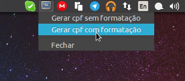

# Sobre
pycpfgen é um programa que gera cpfs aleatórios com o intuito de testes.

# Dependências
Python3 e as seguintes bibliotecas:

- pyqt5

# Utilização
Execute o arquivo `qcpf.py`, e será exibido o ícone no tray, que possui as opções de copiar o cpf, com ou sem formatação, para a área de transferência:

